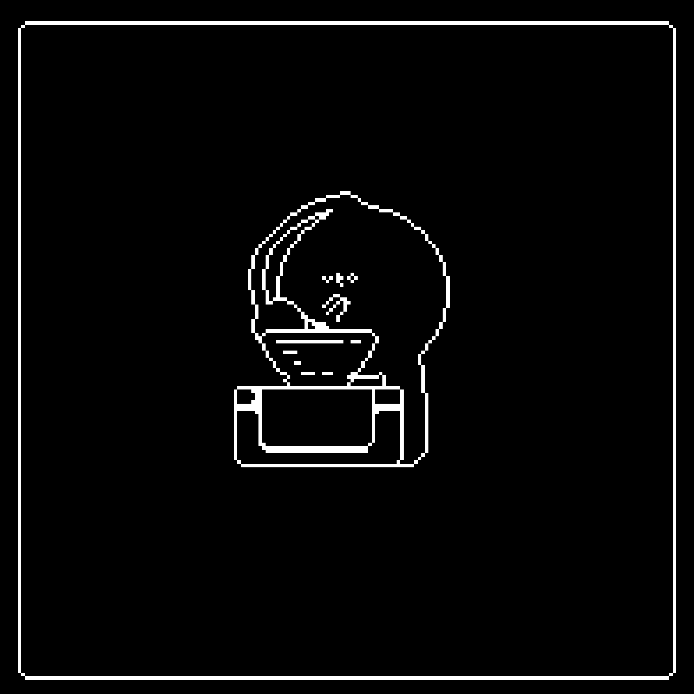
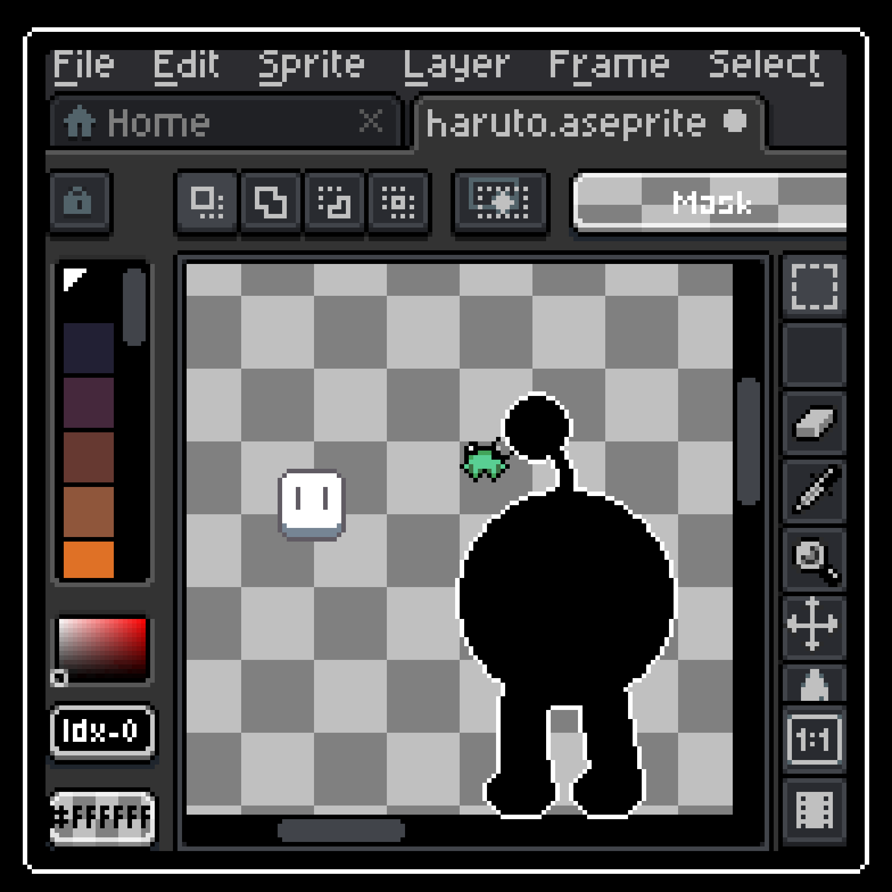

## _👁️ KNOW YOUR HORROR_ 

ㅤ**Entity name:** _haruto.fun_  
ㅤ**A.K.A.:** uto, Haruto Bessa, the thing  
ㅤ**Race:** _Cosmic horror_  
ㅤ**Class:** Multiclass in Game Designer, Composer, Developer, Artist, Director   
ㅤ**Origin:** _Brasil_ / Rio de Janeiro  
ㅤ**Abilities:** Polymath, Self-taught, bearer of the _Emerald Ring_, Stop-Motion Master  
ㅤ**Weaknesses:** Autism, dyslexia, dyscalculia, can't talk to strangers _(working on it)_  
ㅤ**Companion:** _Bino, the Ghost Rabbit God_  
ㅤ  
_**Cool fact:** I built my first prototype in 2016, but I only began dedicating myself to it in 2021, after dropping out of college and quitting my job during the pandemic, following a series of traumatic events that made me rethink my life and decide to follow my dreams._  
### ⚔️ WEAPONS AND MASTERY

ㅤ**GameMaker:** ㅤ  ㅤ ㅤ> 3300 h ㅤ 6 _prototypes_ ㅤ 1 _big game (ongoing)_  
ㅤ**Aseprite:** ㅤ  ㅤ  ㅤ  ㅤ > 1500 h ㅤ _way too many sprites_  
ㅤ**RPG Paper Maker:** ㅤ> 160 hㅤㅤ2 _prototypes_ ㅤ 1 _game (ongoing)_  
ㅤ**Lovely Composer:** ㅤ> 20 h ㅤㅤ 3 _published songs_   
ㅤ**Blockbench:** ㅤ  ㅤ  ㅤ _way too many props_  
ㅤ**Godot:** ㅤ  ㅤ  ㅤ  ㅤ _ㅤbeginner_  
ㅤ**Studying at the moment:**  Human anatomy, hero games, SFX, Godot engine

ㅤ  

### 🦖 CREATIONS OF THE BEAST

ㅤ**TITLE:** _Super SpaceMail_  
ㅤ**RELEASE DATE:** _Coming soon_  
ㅤ**GENRE:** Adventure  
ㅤ**TAGS:** Point-and-click, horror, open-world, multiple-endings, story driven  
ㅤ**DESCRIPTION:** _Super SpaceMail is a point-and-click adventure game about connections where you play as a mailman delivering letters in space, making friends, and solving a mystery way bigger than this universe._  

ㅤ
ㅤ  
ㅤ  
_See more prototypes and other works on [Itch.io](https://harutofun.itch.io) or on [Steam](https://store.steampowered.com/developer/harutofun)!_  
_You can also visit my [website](https://haruto.fun) or my [Spotify](https://open.spotify.com/artist/5VuEnuzmipH0sJXya0ivyn?si=vQd386KzQWeOI8GqLBt57w)._  
_Thanks!_  

